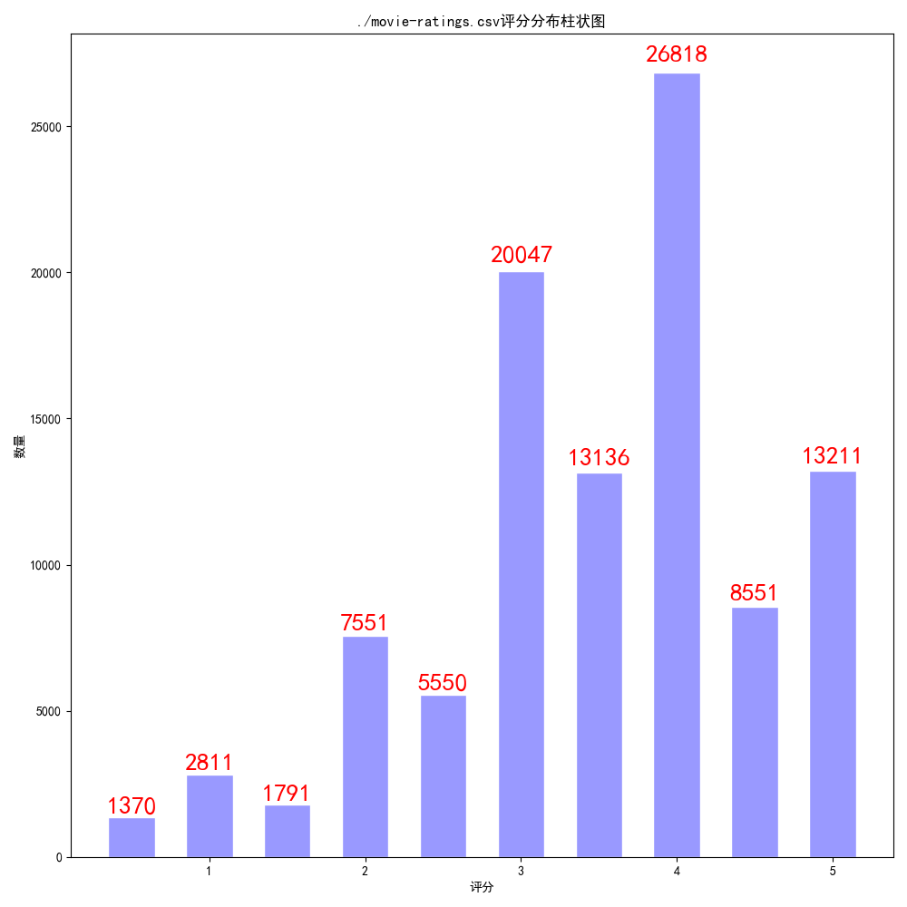
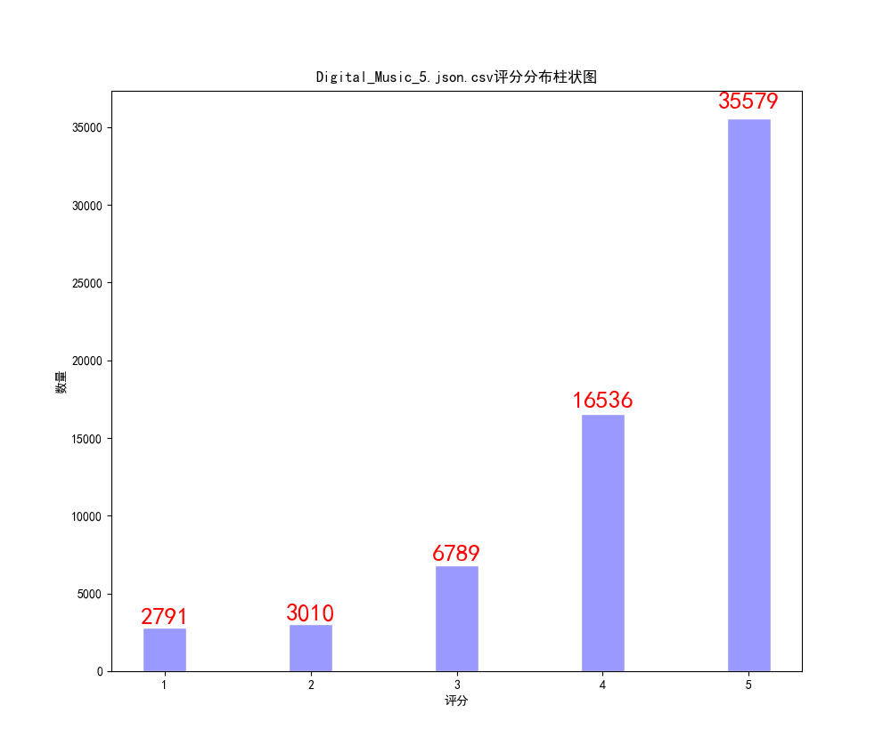
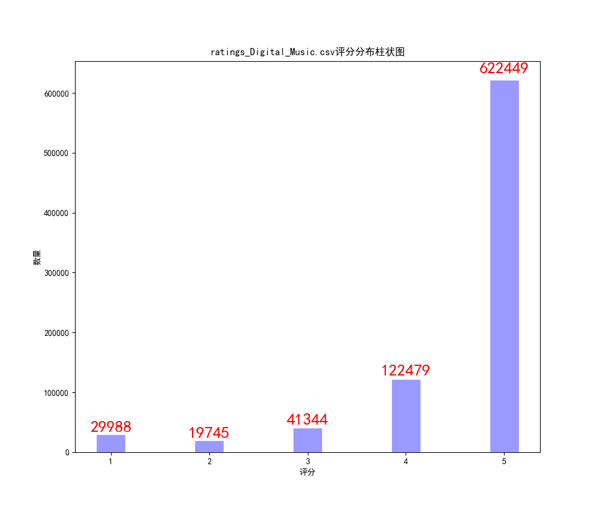
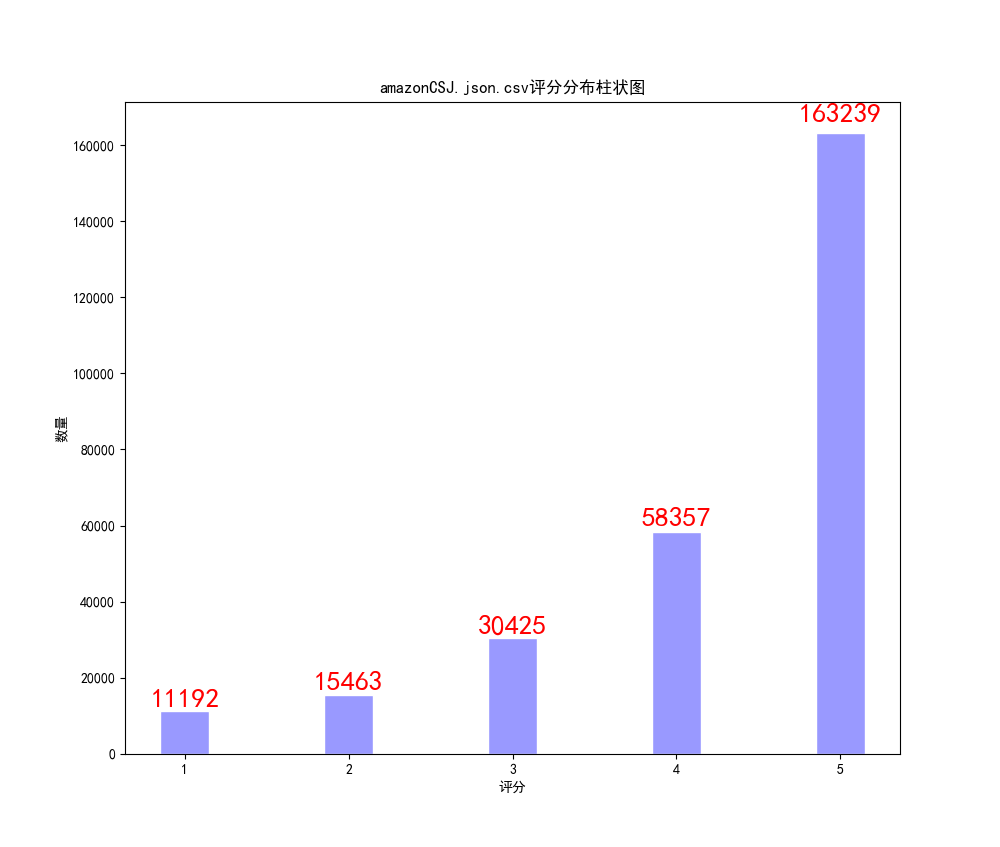
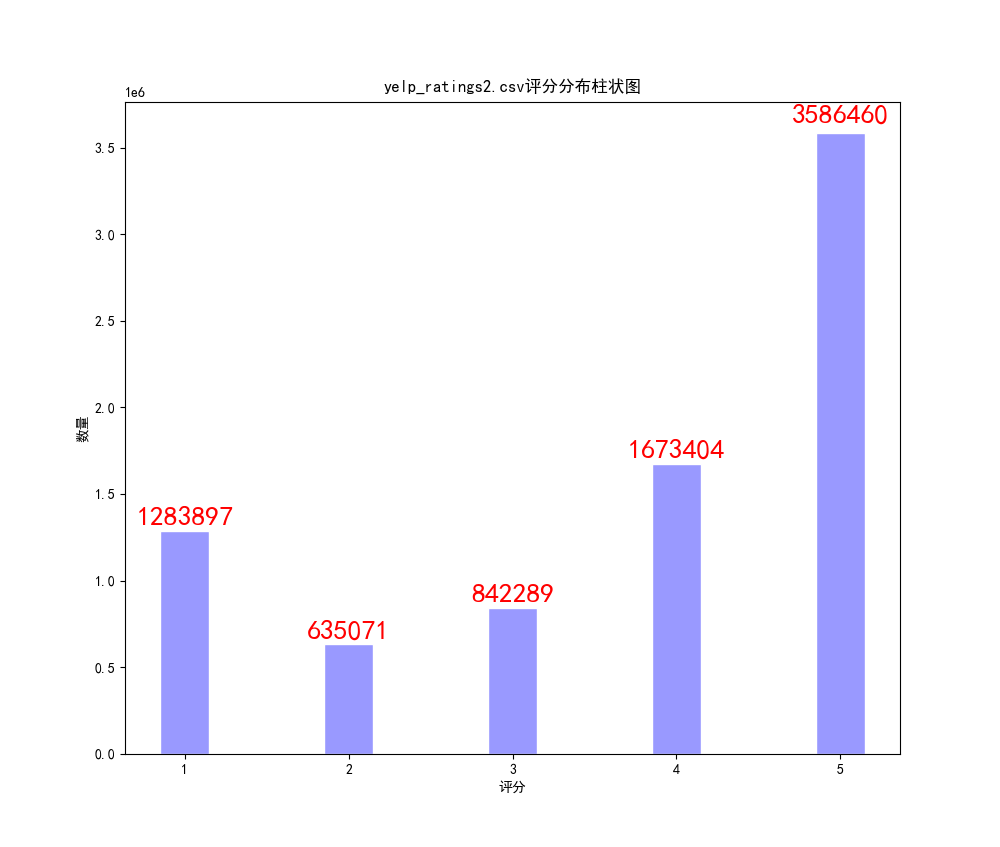

# 推荐系统算法-矩阵分解（MF）

# Main Idea

每个user或item表示为K维向量，分别组成user矩阵P和item矩阵Q。

这里使用FunkSVD方法进行矩阵分解：

原user-item矩阵 = PQ

注：加入正则化防止过拟合。

参考：https://blog.csdn.net/qq_19446965/article/details/82079367

# Environments
+ python 3.8
+ pytorch 1.70

# Dataset

Amazon(2014) http://jmcauley.ucsd.edu/data/amazon/links.html

Yelp(2020) https://www.yelp.com/dataset

For example:
`data/ratings_Digital_Music.csv` (Amazon Digital Music: rating only)

注：本实验将数据集按0.8/0.1/0.1的比例划分为训练集、验证集、测试集。
数据集前三列分别为用户id、产品id、评分（1~5）。
若使用了amazon数据集json格式，可使用amazon_preprocess.py预处理。

# Running
Train and evaluate the model
```
python main.py
```

# Experiment
<table align="center">
    <tr>
        <th>Dataset</th>
        <th>number of users</th>
        <th>number of items</th>
        <th>MSE of MF</th>
    </tr>
    <tr>
        <td><a href="http://files.grouplens.org/datasets/movielens/ml-latest-small.zip">movielens-small</a> (100,836)</td>
        <td>610</td>
        <td>9724</td>
        <td>0.804585</td>
    </tr>
    <tr>
        <td>Amazon Digital Music small (64,706)</td>
        <td>5541</td>
        <td>3568</td>
        <td>0.900899</td>
    </tr>
    <tr>
        <td>Amazon Digital Music (836,006)</td>
        <td>478235</td>
        <td>266414</td>
        <td>0.875224</td>
    </tr>
    <tr>
        <td>Amazon Clothing, Shoes and Jewelry (278,677)</td>
        <td>39387</td>
        <td>23033</td>
        <td>1.161768</td>
    </tr>
    <tr>
        <td>Yelp (8,021,121)</td>
        <td>1968703</td>
        <td>209393</td>
        <td>2.171064</td>
    </tr>
</table>

# Analysis of Dataset

这是对数据集的评分分布进行了分析：
## movielens


## Amazon digital music small


## Amazon digital music


## Amazon Clothing, Shoes and Jewelry


## Yelp
